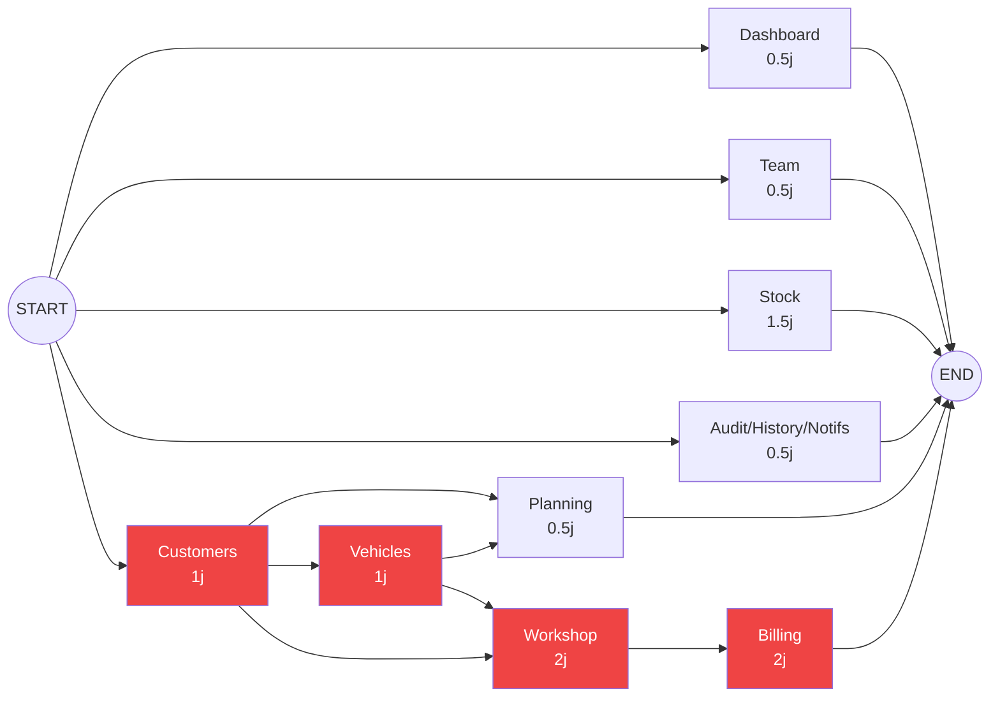

# Plan PERT — Migration Frontend → APIs réelles
> Atelier 2026 · Remplacement de `lib/mock-data.ts` par des appels `lib/api.ts`

---

## Tableau des tâches

| ID | Module | Pages concernées | Durée est. | Dépendances |
|----|--------|-----------------|------------|-------------|
| T1 | **Dashboard** | `app/page.tsx` | 0.5j | — |
| T2 | **Customers** | `customers/page.tsx`, `customers/[id]/page.tsx` | 1j | — |
| T3 | **Team** | `team/page.tsx` | 0.5j | — |
| T4 | **Stock** | `stock/page.tsx`, `stock/[id]/page.tsx`, `stock/movements/page.tsx` | 1.5j | — |
| T5 | **Audit / History / Notifications** | `audit/`, `history/`, `notifications/` | 0.5j | — |
| T6 | **Vehicles** | `vehicles/page.tsx`, `vehicles/[id]/page.tsx` | 1j | T2 |
| T7 | **Planning** | `planning/page.tsx` | 0.5j | T2, T6 |
| T8 | **Workshop** | `workshop/page.tsx`, `workshop/[id]/page.tsx` | 2j | T2, T6 |
| T9 | **Billing** | `billing/page.tsx`, `billing/quotes/[id]/`, `billing/invoices/[id]/` | 2j | T8 |

**Durée totale chemin critique : 6 jours** (T2 → T6 → T8 → T9)

---

## Réseau PERT



---

## Analyse des dates (base : J0 = démarrage)

| ID | ES | EF | LS | LF | Marge | Critique ? |
|----|----|----|----|----|-------|-----------|
| T1 | 0 | 0.5 | 5.5 | 6 | **5.5** | — |
| T2 | 0 | 1 | 0 | 1 | **0** | 🔴 |
| T3 | 0 | 0.5 | 5.5 | 6 | **5.5** | — |
| T4 | 0 | 1.5 | 4.5 | 6 | **4.5** | — |
| T5 | 0 | 0.5 | 5.5 | 6 | **5.5** | — |
| T6 | 1 | 2 | 1 | 2 | **0** | 🔴 |
| T7 | 2 | 2.5 | 5.5 | 6 | **3.5** | — |
| T8 | 2 | 4 | 2 | 4 | **0** | 🔴 |
| T9 | 4 | 6 | 4 | 6 | **0** | 🔴 |

> **ES** = Earliest Start · **EF** = Earliest Finish · **LS** = Latest Start · **LF** = Latest Finish

---

## Chemin critique

```
T2 (Customers, 1j) → T6 (Vehicles, 1j) → T8 (Workshop, 2j) → T9 (Billing, 2j)
```
Tout retard sur ces 4 tâches retarde la livraison finale.

---

## Parallélisation optimale

```
J0 ──────────────────────────────────────────────── J6
│
├─ [Critique] T2 Customers ──► T6 Vehicles ──► T8 Workshop ──► T9 Billing
│
├─ T1 Dashboard       (J0–J0.5)  ░░ marge libre jusqu'à J6
├─ T3 Team            (J0–J0.5)  ░░ marge libre jusqu'à J6
├─ T4 Stock           (J0–J1.5)  ░░ marge libre jusqu'à J6
├─ T5 Audit/Hist/Notif(J0–J0.5)  ░░ marge libre jusqu'à J6
└─ T7 Planning        (J2–J2.5)  ░░ démarre dès T6 terminé, marge 3.5j
```

**Stratégie recommandée :** commencer T2 (Customers) en priorité absolue, lancer T1/T3/T4/T5 en parallèle dès que possible.

---

## Détail par tâche

### T1 · Dashboard
- Remplacer les stats hardcodées par un appel `GET /api/dashboard/stats`
- Brancher `RevenueChart`, `StatusDistributionChart`, `TechEfficiencyChart` sur données réelles

### T2 · Customers *(critique)*
- Liste avec recherche → `customersApi.list()`
- Fiche détail → `customersApi.get(id)`
- Formulaire création/édition → `customersApi.create()` / `.update()`
- Suppression soft → `customersApi.delete()`

### T3 · Team
- Liste techniciens → `teamApi.list()`
- Fiche détail + OTs actifs → `teamApi.get(id)`

### T4 · Stock
- Catalogue pièces + alertes seuil → `stockApi.listParts()`
- Fiche pièce → `stockApi.getPart(id)`
- Mouvements → `stockApi.listMovements()`

### T5 · Audit / History / Notifications
- Logs → `auditApi.logs()`
- SMS → `notificationsApi.smsHistory()`

### T6 · Vehicles *(critique)*
- Liste → `vehiclesApi.list()`
- Fiche + historique OTs → `vehiclesApi.get(id)`
- Formulaire avec dropdowns marques/modèles → `vehiclesApi.makes()` + `.models(makeId)`

### T7 · Planning
- Agenda → `planningApi.list({ date })`
- Créer/modifier/supprimer RDV → `planningApi.create()` / `.update()` / `.delete()`

### T8 · Workshop *(critique)*
- Kanban/liste OTs → `workshopApi.listOTs()`
- Fiche OT complète (observations, work-items, réception, QC) → `workshopApi.getOT(id)`
- Machine à états → `workshopApi.updateStatus()`
- Assigner technicien → `workshopApi.assign()`

### T9 · Billing *(critique)*
- Liste devis + factures → `billingApi.listQuotes()` + `.listInvoices()`
- Détail devis → `billingApi.getQuote(id)`
- Détail facture + paiement → `billingApi.getInvoice(id)` + `.recordPayment()`
- Transformer devis → facture → `billingApi.createInvoiceFromQuote()`

---

## Skills nécessaires pour un Frontend propre (Anti-Bugs Silencieux)

### 1. Typage strict des réponses API (TypeScript Interfaces)
Ne jamais stocker une réponse API dans une variable `any`. Créer une interface TypeScript pour chaque entité métier.
```typescript
// ✅ Propre
interface Customer { id: string; lastName: string; customerType: CustomerType; }
const customer: Customer = await customersApi.get(id);

// ❌ Bug silencieux garanti
const customer: any = await customersApi.get(id);
```

### 2. Validation côté Frontend (Zod)
Valider les données des formulaires **avant** d'envoyer la requête API. `Zod` garantit que si le champ `email` est vide, la requête API n'est jamais appelée.
- **Outil** : `zod` + `react-hook-form` (déjà installés dans le projet)
- **Principe** : Séparation entre erreurs UI (Zod) et erreurs Serveur (codes HTTP retournés par le backend)

### 3. Gestion Centralisée des Erreurs API
Toutes les requêtes passent par `lib/api.ts`. Ce client centralisé doit :
- Rediriger vers `/login` si le serveur répond `401`
- Afficher un toast d'erreur si le serveur répond `409 / 404 / 500`
- **Jamais** laisser l'utilisateur sur un écran blanc sans feedback

### 4. Séparation des Préoccupations (Hooks Custom)
Le code de fetching ne doit **jamais** vivre dans le composant React directement.
```typescript
// ✅ Propre — le composant ne connaît pas Axios/fetch
const { data: customers, isLoading, error } = useCustomers();

// ❌ Bug silencieux — logique mélangée à l'UI
const [customers, setCustomers] = useState<any[]>([]);
useEffect(() => { fetch('/api/customers')..., [] });
```
- **Outils** : Custom hooks (`hooks/use-api.ts`) ou **TanStack Query** pour la mise en cache automatique

### 5. Loading States et Skeleton UI
Chaque composant qui charge des données doit avoir 3 états :
1. **Loading** → Afficher un `Skeleton` (évite le "flash" de contenu vide)
2. **Error** → Afficher un message avec bouton "Réessayer"
3. **Success** → Afficher les données

Si on oublie l'état erreur, l'utilisateur voit un écran blanc sans raison → bug silencieux UX.

### 6. Optimistic Updates (UX avancée)
Pour des actions fréquentes (changer le statut d'un OT, valider un paiement), mettre à jour l'interface **immédiatement** avant la confirmation serveur, puis annuler si le serveur répond une erreur.
- **Outil** : Mutation de TanStack Query ou gestion manuelle avec `onMutate` / `onError`

### 7. Accessibilité et Sécurité XSS
- Ne jamais injecter de HTML depuis l'API avec `dangerouslySetInnerHTML`
- Utiliser des attributs `aria-*` sur tous les composants interactifs (tables, modales, boutons)
- **Outil** : ESLint plugin `eslint-plugin-jsx-a11y` pour détecter les oublis
