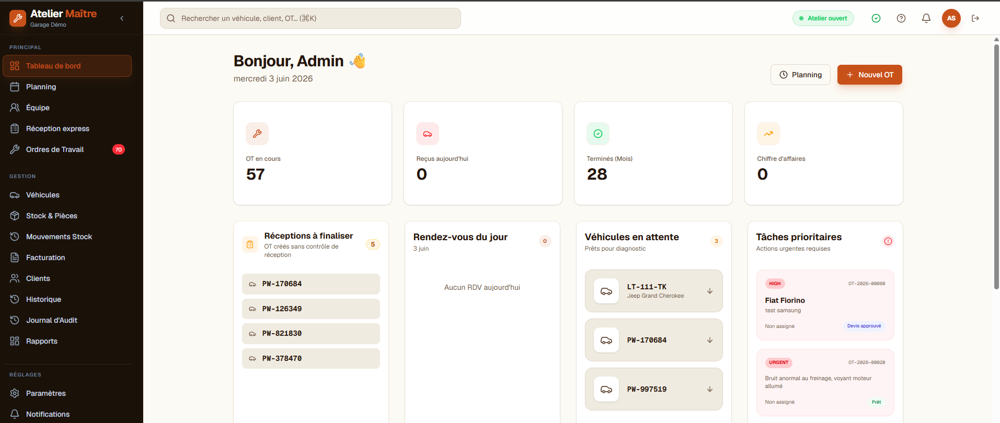
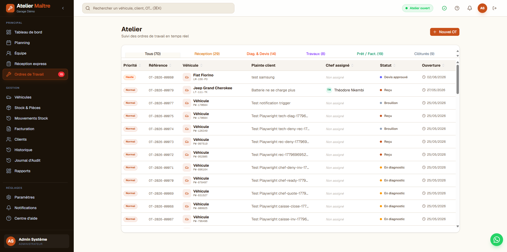
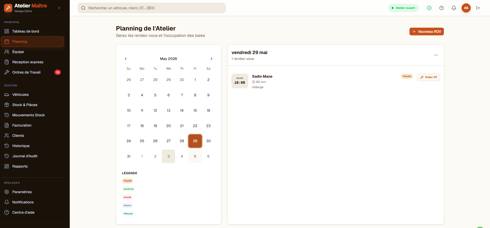
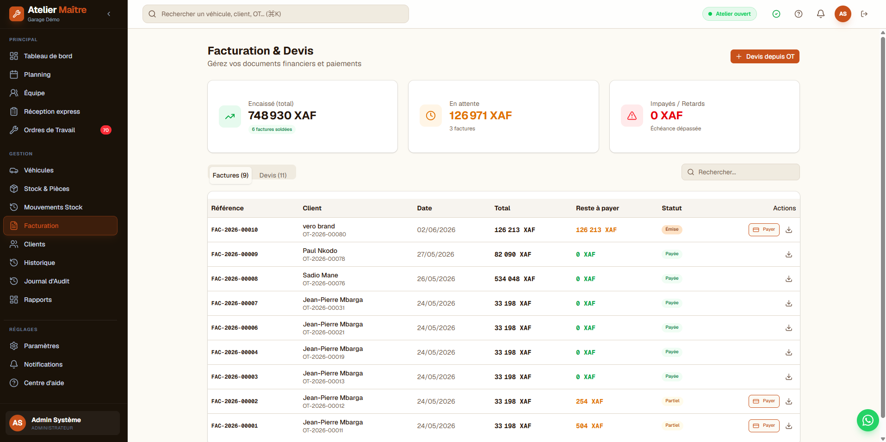
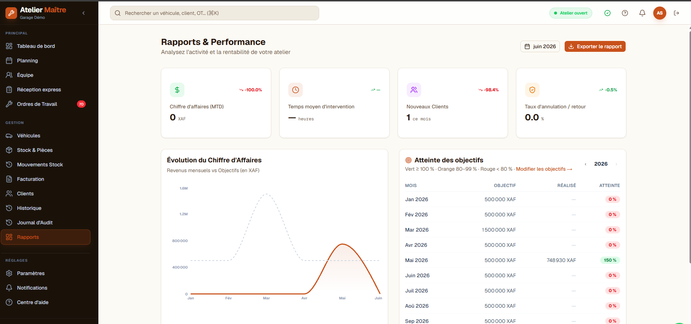

# Atelier Maître

**Production workshop management platform for automotive service operations.**

Atelier Maître brings the main day-to-day workflows of a mechanical workshop into one system: customers and vehicles, work orders, planning, inventory, billing, cash operations and activity monitoring.

<p align="center">
  <a href="https://atelier.trigenys.com/"><strong>Open the live application</strong></a>
</p>

<p align="center">
  <a href="https://atelier.trigenys.com/">
    
  </a>
</p>

## Product views

| Workshop operations | Planning |
| --- | --- |
|  |  |
| **Billing** | **Reporting** |
|  |  |

## What it covers

- **Workshop operations** — reception, work orders, planning, execution and job follow-up
- **Customers & vehicles** — customer records, vehicles and service history
- **Inventory** — spare parts, stock movements and availability tracking
- **Billing & cash operations** — quotations, invoices, payments and daily cash workflows
- **Team access** — authenticated users, roles and permissions
- **Reporting** — operational and financial indicators for workshop activity

The application is designed around real workshop workflows rather than a generic CRUD structure: operational actions, stock movements and financial events are connected so that the state of a job can be followed from reception to closure.

## Architecture

```text
Next.js 15 + React 19
        │
        ▼
NestJS 11 API
        │
        ├── Prisma ORM
        ├── PostgreSQL
        ├── Redis / BullMQ
        └── scheduled/background jobs
```

Production deployment is containerized with Docker and hosted on AWS infrastructure.

### Main stack

- **Frontend:** Next.js, React, TypeScript, Tailwind CSS
- **Backend:** NestJS, TypeScript, Swagger, JWT authentication
- **Data:** PostgreSQL, Prisma
- **Async processing:** Redis, BullMQ
- **Testing:** Jest, Supertest, Playwright, Newman
- **Delivery:** Docker, semantic-release, GitHub Actions, AWS

## Development

### Requirements

- Node.js
- npm
- PostgreSQL
- Redis for queue-backed features

### Setup

```bash
git clone https://github.com/EagleFox31/atelier2026.git
cd atelier2026
npm install
cp .env.example .env
npm run dev
```

The repository includes `.env.example` with the configuration expected by the frontend, API and supporting services.

### Useful commands

```bash
npm run dev            # frontend + API development
npm run type:check     # frontend and backend TypeScript checks
npm test               # unit/integration tests
npm run test:e2e       # API end-to-end collection
npm run test:pw        # browser tests with Playwright
npm run build          # Next.js production build
npm run build:api      # API production build
```

## Project status

**Status: Production**

The current focus is production hardening: monitoring, backup verification, deployment reliability and continued validation of the operational workflows.

## Repository note

This repository contains the application source for Atelier Maître. It is a real delivered project, not a generated demo or template. Public documentation intentionally focuses on the product and technical architecture rather than client-specific operational data or production secrets.

## License

Copyright © 2026 EagleFox31. **All rights reserved.**

This codebase is proprietary. See [`LICENSE`](LICENSE) for the applicable terms.
